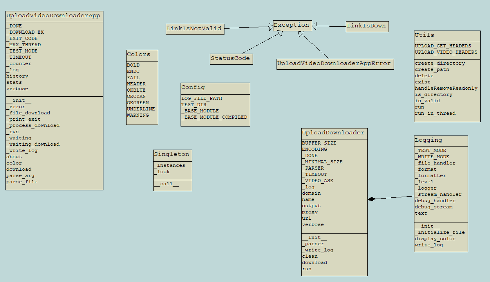

upload_scraping
==============

> Download video from html page or html iframe. Just need link :)

Installation
--------------

### How to install ?

* get the netu_scraping source code
```sh
$ git clone <upload_scraping repo> <src dir>
```
* into **root directory** 
```sh
$ pip install .
```

Usage
--------------

* download video from url
```sh
$ upload_video_downloader.py d -s <your url> -o <output_directory>
$ upload_video_downloader.py download -s <your url> -o <output_directory> -v
$ upload_video_downloader.py download -s <your url>
```
* download video from file
```sh
$ upload_video_downloader.py d -s <your file> -o <output_directory>
$ upload_video_downloader.py download -s <your file> -o <output_directory> -v
$ upload_video_downloader.py download -s <your file>
```

Test
--------------
* test in **local**
```sh
$ py -m unittest discover
$ pytest test
```

Schema
--------------




Announcement
--------------
upload_scraping is an experimental project